# Wazuh + SOAR Implementation

## Project Overview
This project demonstrates the implementation of a Security Information and Event Management (SIEM) system using **Wazuh** integrated with **The Hive** for case management and **Shuffle** for SOAR (Security Orchestration, Automation, and Response) capabilities.

### Tools Used
- **Wazuh**: SIEM and XDR
- **The Hive**: Case management system
- **Shuffle**: SOAR platform
- **VirusTotal API**: Reputation check

---

## 1. Architecture Diagram
The diagram below shows the data flow across different components of the project.

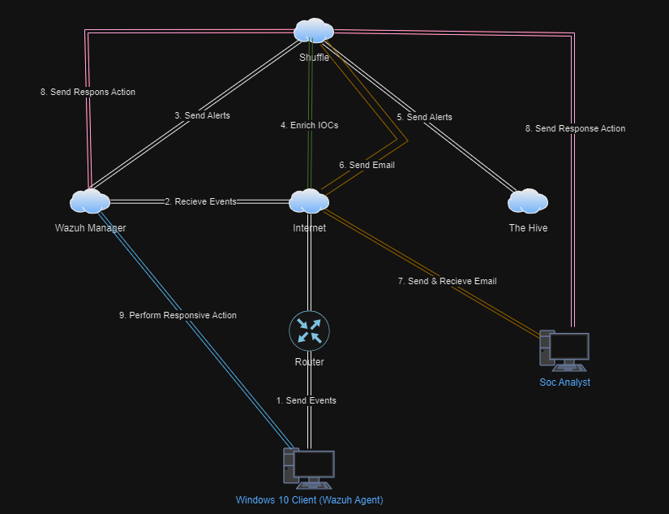

---

## 2. Setting Up Sysmon on Windows 10 VM
Sysmon was installed on a Windows 10 VM to generate relevant logs for analysis.

### Steps:
1. Download Sysmon.
2. Install Sysmon to monitor system events.

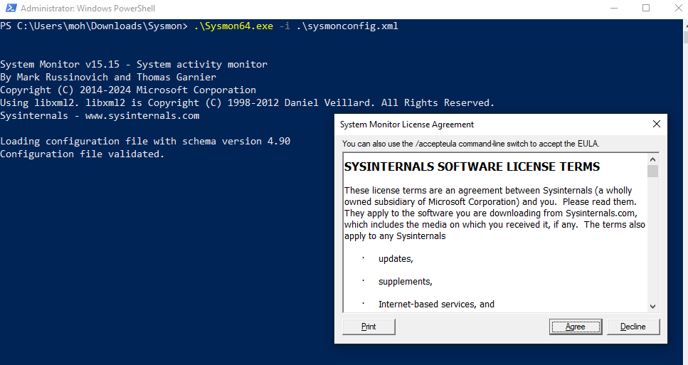

---

## 3. Wazuh Server Setup on Digital Ocean
Wazuh server was deployed on **Ubuntu 22.04** using Digital Ocean as the cloud provider. A firewall was configured to control access, and the server was accessed via SSH.

### Steps:
1. Setup Wazuh server on Digital Ocean.
2. Configure firewall rules to allow necessary traffic.
3. Download Wazuh on the server.
4. Access Wazuh GUI via the browser.

#### Firewall Rules:
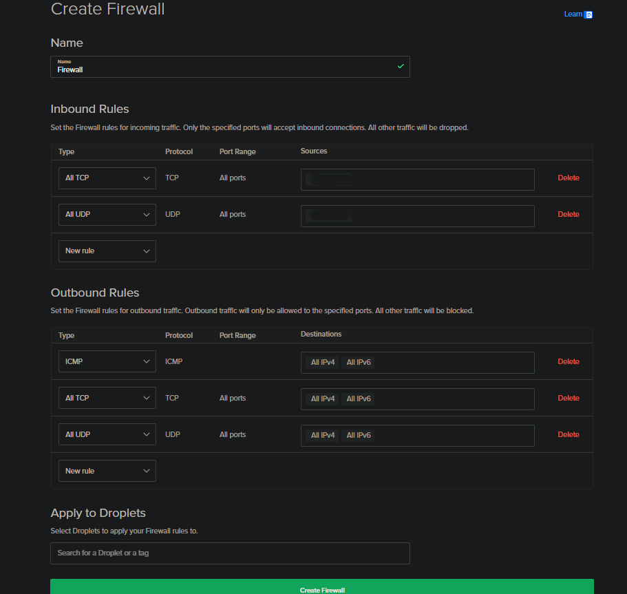

#### Accessing the Server via SSH:
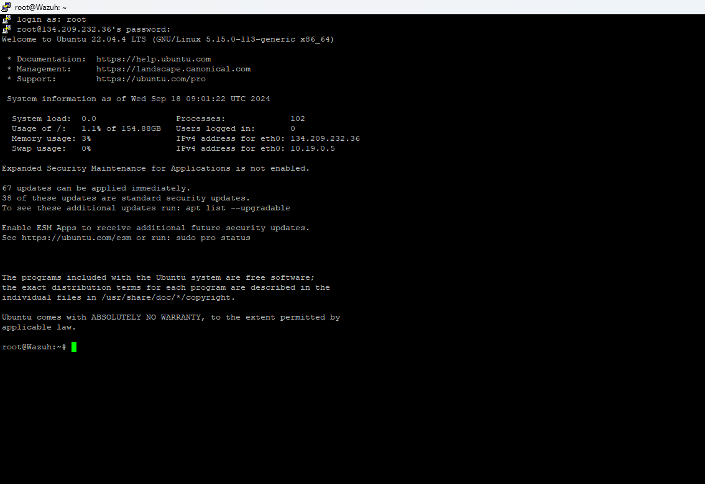

#### Downloading Wazuh in CLI:
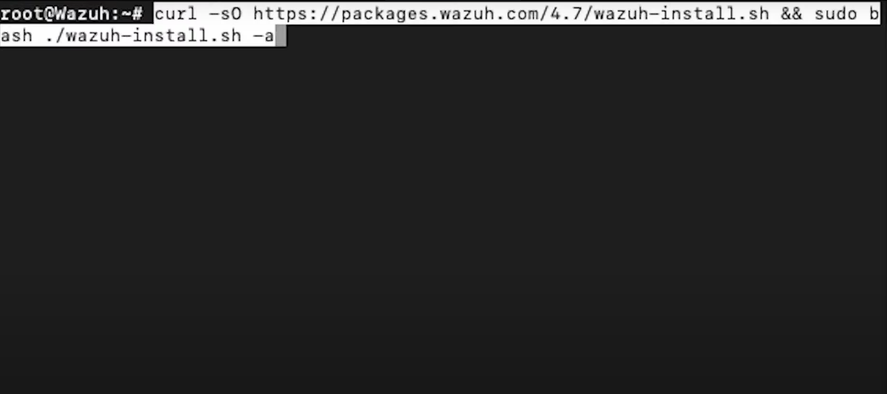

#### Wazuh GUI:
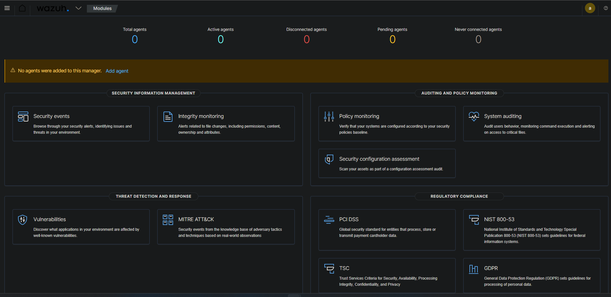

---

## 4. The Hive Server Setup on Digital Ocean
Similarly, **The Hive** was deployed on **Ubuntu 22.04** on the same cloud provider. The installation included prerequisites such as **Java**, **Cassandra**, **ElasticSearch**, and finally The Hive.

### Steps:
1. Set up Hive server.
2. Install prerequisites (Java, Cassandra, ElasticSearch).
3. Download and install The Hive.

#### Prerequisite Installation:
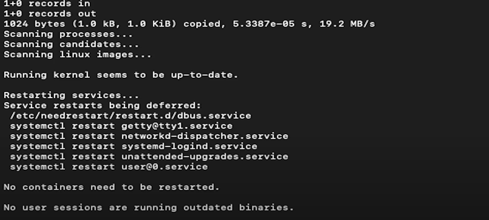

#### Hive Status in CLI:
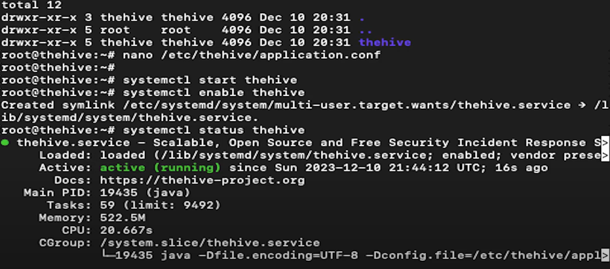

*Note*: A separate file containing the detailed download instructions is provided in the repository [here](hive-install-instructions.txt).

---

## 5. Adding an Agent to Wazuh
The Windows 10 VM (with Sysmon installed) was added as an agent to the Wazuh server for log ingestion and analysis.

### Steps:
1. Execute PowerShell commands on the VM to register it as a Wazuh agent.
2. Confirm successful agent registration.

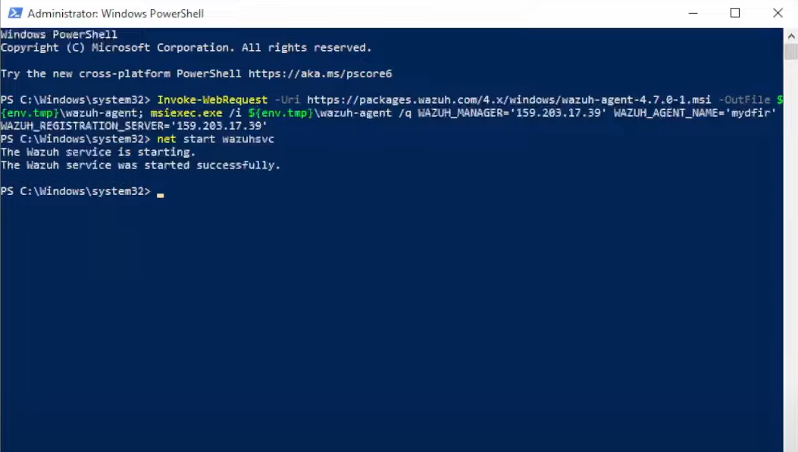

---

## 6. Detecting Mimikatz with Wazuh
**Mimikatz**, a credential extraction tool, was run on the Windows 10 VM to generate malicious activity. Wazuh successfully detected this activity and raised an alert.

### Steps:
1. Download and run Mimikatz on the Windows VM.
2. Wazuh detects the malicious activity.

#### Running Mimikatz:
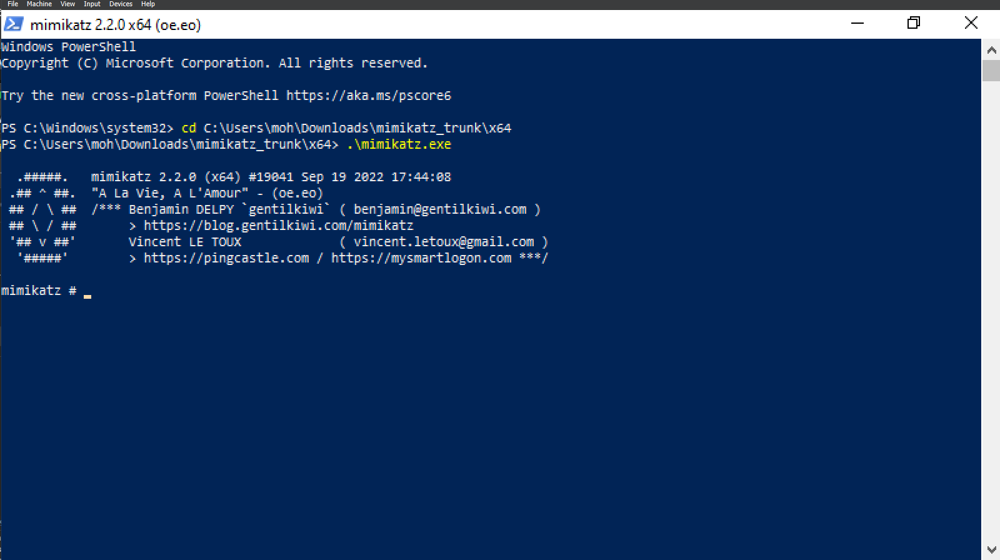

#### Wazuh Detects Mimikatz:
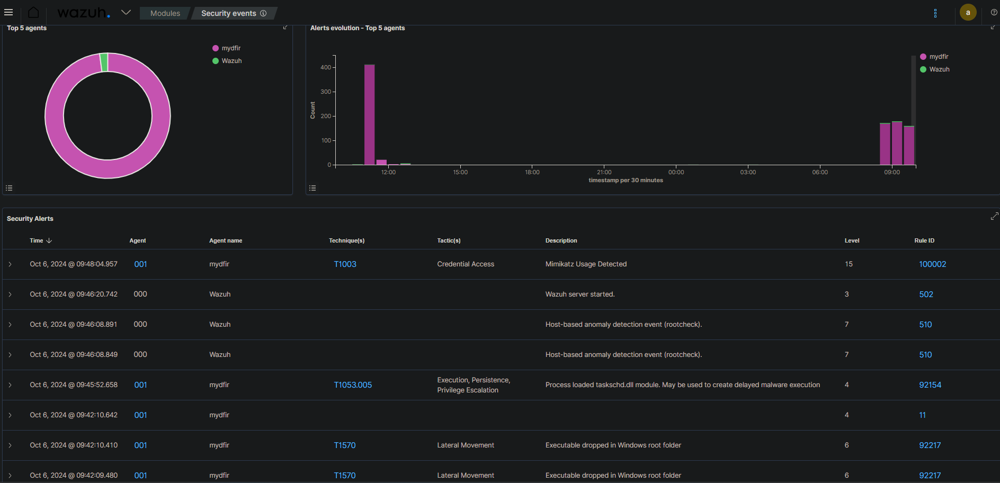

---

## 7. Integrating Shuffle for SOAR Capabilities
Wazuh was integrated with **Shuffle** using a webhook. Shuffle received the Mimikatz detection alert and processed it further.

### Steps:
1. Add Wazuh as a webhook in Shuffle.
2. Confirm that Shuffle received the detection alert.

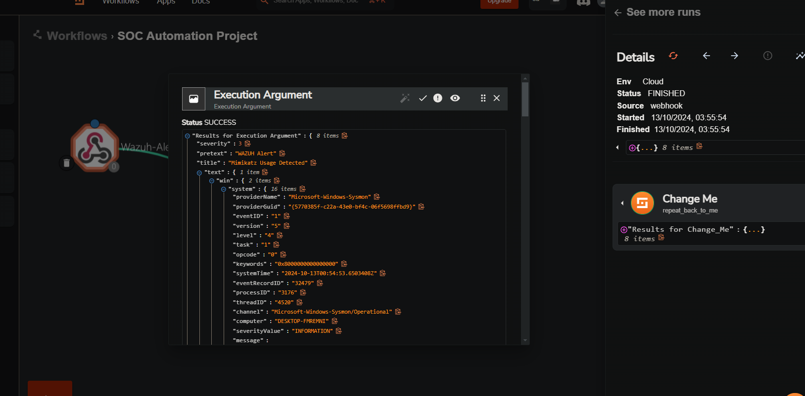

---

## 8. Using Shuffle for Automation
Shuffle was configured to extract the **SHA256 hash** from the Mimikatz alert using **Regex**. This hash was then sent to **VirusTotal** for a reputation check via the VirusTotal API.

### Steps:
1. Configure Shuffle to extract SHA256 from the alert.
2. Add VirusTotal API to Shuffle for reputation checks.
3. Perform a reputation check on the file.

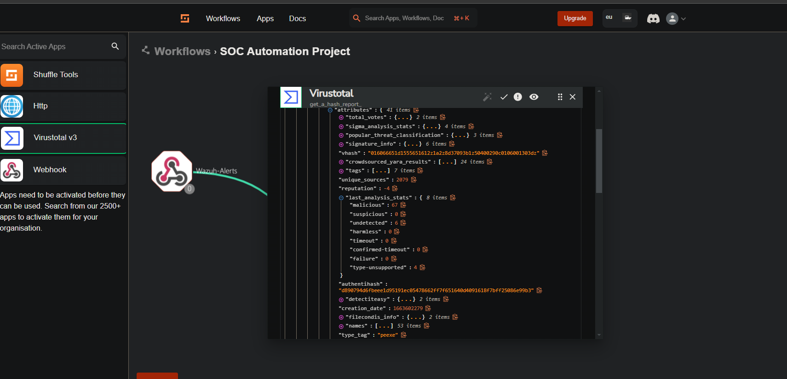

---

## 9. Sending Alerts to The Hive
Shuffle was configured to send alerts to **The Hive** using The Hive's API, where a case was automatically created for further investigation.

### Steps:
1. Add The Hive API to Shuffle.
2. Send the alert details to The Hive and create a case.

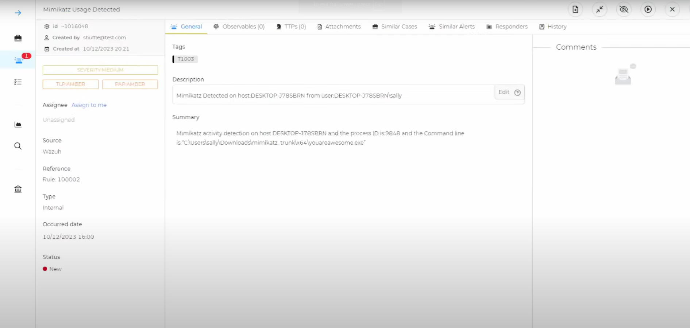

---

## 10. Notifying SOC Analyst via Email
Finally, Shuffle was configured to send an email notification to a SOC analyst whenever an alert was detected and sent to The Hive.

### Steps:
1. Configure Shuffle to send email alerts to the SOC analyst.
2. Ensure the email is received with alert details.

#### Email Configuration in Shuffle:
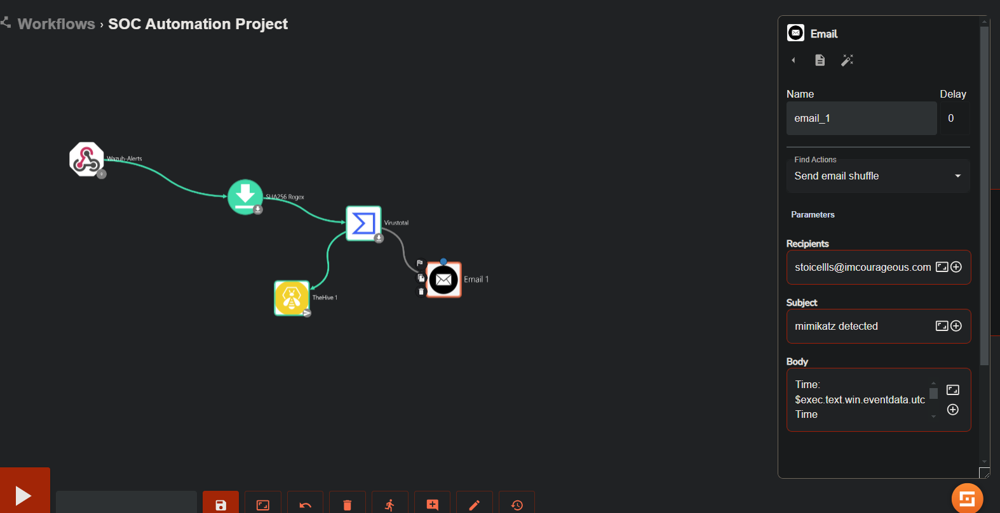

#### Email Received by SOC Analyst:
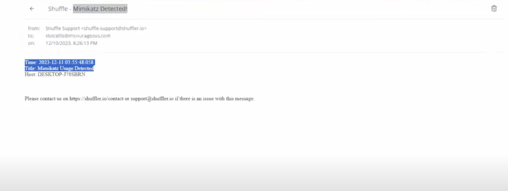

---

## Conclusion
This project showcases how to effectively integrate Wazuh with SOAR capabilities through Shuffle and use The Hive for case management. The implementation ensures seamless detection of malicious activity, automated responses, and effective case management.
